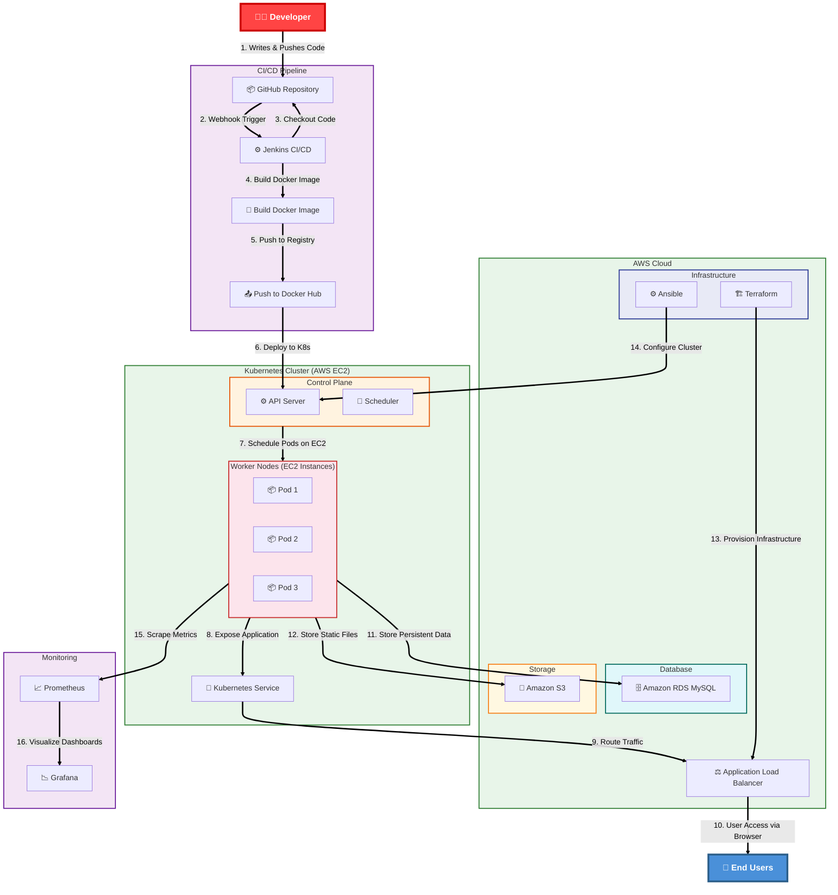

<!-- Header Banner -->

<div align="center">
<!-- Typing Animation -->
<a href="https://linkedin.com/in/prayag-dutt">
  
</a>
<br>
<!-- Social Badges (Using their official brand colors for better recognition) -->
<a href="https://github.com/Prayag762">
  
</a>
<a href="https://linkedin.com/in/prayag-dutt">
  
</a>
<a href="mailto:prayag.dutt@email.com">
  
</a>
<br><br>
<!-- Profile Views -->

</div>
---
# 🚀 Enterprise DevOps Task Management Platform

### End-to-End CI/CD Pipeline | AWS | Terraform | Docker | Jenkins | Kubernetes | Ansible | Grafana

> A production-style cloud-native DevOps project demonstrating Infrastructure as Code (IaC), Continuous Integration & Continuous Deployment (CI/CD), containerization, Kubernetes orchestration, and AWS cloud deployment.

---

## 📖 Project Overview

The **Enterprise DevOps Task Management Platform** demonstrates a complete DevOps lifecycle from infrastructure provisioning to application deployment using modern DevOps tools and AWS cloud services.

The application is built using **Python Flask** with **Amazon RDS MySQL** as the backend database. Infrastructure is provisioned using **Terraform**, containerized using **Docker**, and deployed automatically through **Jenkins CI/CD**. Kubernetes deployment manifests are included to demonstrate container orchestration and production deployment readiness.

The project follows enterprise DevOps practices including Infrastructure as Code, automated deployments, containerization, and cloud-native architecture.

## 🏗 Architecture Diagram


🔄 CI/CD Pipeline Workflow

### 🔄 CI/CD Pipeline Workflow


## ☁ AWS Architecture

The complete AWS infrastructure is provisioned using Terraform.

### 🏗️ Infrastructure Components

**Resources Created:**

- ✅ Amazon VPC
- ✅ Public Subnets
- ✅ Private Subnets
- ✅ Internet Gateway
- ✅ NAT Gateway
- ✅ Route Tables
- ✅ Security Groups
- ✅ EC2 Instances
- ✅ Amazon RDS MySQL
- ✅ Amazon S3
- ✅ Application Load Balancer
- ✅ IAM Roles

## ⚙ Technology Stack

| Category | Technologies |
|---|---|
| Database | MySQL, Amazon RDS |
| Containerization | Docker |
| Container Orchestration | Kubernetes |
| CI/CD | Jenkins |
| Infrastructure as Code | Terraform |
| Configuration Management | Ansible |
| Cloud Platform | AWS |
| Monitoring |  Grafana |
| Image Registry | Docker Hub |
| Version Control | Git & GitHub |

## ☁️ AWS Services Used

- ☁️ Amazon EC2
- ☁️ Amazon RDS (MySQL)
- ☁️ Amazon VPC
- ☁️ Public & Private Subnets
- ☁️ Internet Gateway
- ☁️ NAT Gateway
- ☁️ Route Tables
- ☁️ Security Groups
- ☁️ Application Load Balancer
- ☁️ IAM
- ☁️ Amazon S3

## 📂 Repository Structure

```text
enterprise-devops-platform/
│
├── App_Login_Screenshot          # APP SCREENSHOTS
│   ├── APP_HOME_PAGE/
│   ├── APP_LOGIN_PAGE/
│
├── Src/                          # Flask Application
│   ├── app/
│   ├── migrations/
│   ├── requirements.txt
│   └── run.py
│
├── terraform/                    # Infrastructure as Code
│   ├── vpc.tf
│   ├── subnet.tf
│   ├── internet-gateway.tf
│   ├── nat-gateway.tf
│   ├── route-table.tf
│   ├── security-group.tf
│   ├── ec2.tf
│   ├── alb.tf
│   ├── target-group.tf
│   ├── rds.tf
│   ├── s3.tf
│   ├── variables.tf
│   ├── versions.tf
│   └── userdata.sh
│
├── ansible/                      # Configuration Management
│   ├── playbook.yml
│   └── inventory/
│
├── k8s/                          # Kubernetes Manifests
│   ├── deployment.yaml
│   └── service.yaml
│
├── Dockerfile
├── Jenkinsfile
├── README.md
└── .gitignore
```

## ✨ Key Features

- ✅ End-to-End CI/CD Pipeline using Jenkins
- ✅ Infrastructure Provisioning using Terraform
- ✅ Configuration Management using Ansible
- ✅ Dockerized Flask Application
- ✅ Docker Hub Image Repository
- ✅ Kubernetes Deployments
- ✅ Rolling Updates
- ✅ Self-Healing Pods
- ✅ Replica Management
- ✅ Amazon RDS Integration
- ✅ Amazon S3 Integration
- ✅ Application Load Balancer
- ✅ Public & Private Networking
- ✅ Secure Security Groups
- ✅ Infrastructure Automation
- ✅ Production-style DevOps Workflow
- ✅ Monitoring Ready 
  
## 🐳 Docker

### Build Image

```bash
docker build -t prayag1/enterprise-devops-platform:latest .
```
### Login to Docker Hub
```bash
docker login
```
### Push Image
```bash
docker push prayag1/enterprise-devops-platform:latest
```
### Run Container
```bash
docker run -d \
  -p 5000:5000 \
  --name devops-platform \
  prayag1/enterprise-devops-platform:latest
```

## ☸ Kubernetes

### Deploy Application
```bash
kubectl apply -f k8s/deployment.yaml
kubectl apply -f k8s/service.yaml
```
### Check Pods
```bash
kubectl get pods
```
### Check Services
```bash
kubectl get svc
```
### Scale Application
```bash
kubectl scale deployment enterprise-devops-platform --replicas=5
```
### Rolling Update
```bash
kubectl set image deployment/enterprise-devops-platform \
  enterprise-devops-platform=prayag1/enterprise-devops-platform:latest
```

## 🌍 Terraform

### Initialize
```bash
cd terraform
terraform init
```
### Plan
```bash
terraform plan
```
### Apply
```bash
terraform apply -auto-approve
```
### Destroy
```bash
terraform destroy
```
## ⚙ Ansible
### Run Playbook
```bash
ansible-playbook -i inventory/production playbook.yml
```
### Check Syntax
```bash
ansible-playbook playbook.yml --syntax-check
```
### Dry Run
```bash
ansible-playbook playbook.yml --check
```
## 📊 Monitoring

The platform is designed to integrate with modern monitoring tools.

### Monitoring Stack

- 📉 **Grafana** - Dashboards & Visualization

### Monitoring Capabilities

- Infrastructure Monitoring
- Container Monitoring
- CPU & Memory Utilization
- Application Health
- Kubernetes Metrics
- Alerting & Dashboards
- 🔍 Infrastructure Monitoring
- 📦 Container Monitoring
- ⚡ CPU & Memory Utilization
- 🏥 Application Health
- ☸️ Kubernetes Metrics
- 🔔 Alerting & Dashboards

## 🔐 Security Features

- 🔒 Private Amazon RDS
- 🔒 Security Groups
- 🔒 IAM Roles
- 🔒 Private Networking
- 🔒 Public/Private Subnet Separation
- 🔒 Least Privilege Access
- 🔒 Security Group Rules
- 🔒 Network Isolation

## 📈 Future Enhancements

- Kubernetes Ingress Controller
- Horizontal Pod Autoscaler (HPA)
- Helm Charts
- AWS EKS Deployment
- ArgoCD GitOps
- SonarQube Integration
- Trivy Image Scanning
- AWS CloudWatch Logs
- Prometheus Alert Manager
- SSL/TLS using AWS ACM
- Route53 DNS
- Blue-Green Deployment
- Canary Deployment
- 🚀 Kubernetes Ingress Controller
- 🔄 Horizontal Pod Autoscaler (HPA)
- 📦 Helm Charts
- ☁️ AWS EKS Deployment
- 🔄 ArgoCD GitOps
- 🔍 SonarQube Integration
- 🛡️ Trivy Image Scanning
- 📝 AWS CloudWatch Logs
- 🔔 Prometheus Alert Manager
- 🔐 SSL/TLS using AWS ACM
- 🌐 Route53 DNS
- 🔵🟢 Blue-Green Deployment
- 🐤 Canary Deployment

## 🎯 Learning Outcomes

This project demonstrates practical experience with:

- ☁️ AWS Cloud
- 🔄 DevOps Practices
- 🏗️ Infrastructure as Code
- 🔄 Continuous Integration
- 🚀 Continuous Deployment
- 🐳 Docker
- ☸ Kubernetes
- 🌍 Terraform
- ⚙️ Jenkins
- 🐙 GitHub
- 🐧 Linux Administration
- 🌐 Cloud Networking
- 📊 Monitoring & Observability
- 🔐 Security Best Practices
---

## 👨💻 Author

**Prayag Dutt**

## 🤝 Let's Connect!

<div align="center">
  <p style="color: #8b949e; max-width: 550px; margin: 0 auto 25px;">
    Always open to collaborations, DevOps discussions, or just a friendly chat. 
    Let's build something amazing together! 🚀
  </p>

  <div style="display: flex; justify-content: center; gap: 15px; flex-wrap: wrap;">
    <a href="https://github.com/Prayag762"></a>
    <a href="https://linkedin.com/in/prayag-dutt"></a>
    <a href="mailto:prayag.dutt@email.com"></a>
  </div>

  <br />

  <div style="padding: 15px 20px; background: rgba(54, 188, 247, 0.05); border-radius: 10px; border-left: 3px solid #36BCF7;">
    <p style="margin: 0; color: #c9d1d9;">
      ⭐ <strong style="color: #36BCF7;">Star this repo</strong> if you found it valuable — it helps others discover this project!
    </p>
  </div>

  <br />

  <p style="color: #8b949e; font-size: 0.85rem;">
    Made with ☕ and ❤️ using DevOps
  </p>
</div>

---

<div align="center">
  
</div>

<div align="center">
  <b style="background: linear-gradient(135deg, #667eea, #764ba2); -webkit-background-clip: text; -webkit-text-fill-color: transparent; font-size: 1.1rem;">
    ⭐ If this project helped you, don't forget to star the repository! ⭐
  </b>
</div>
